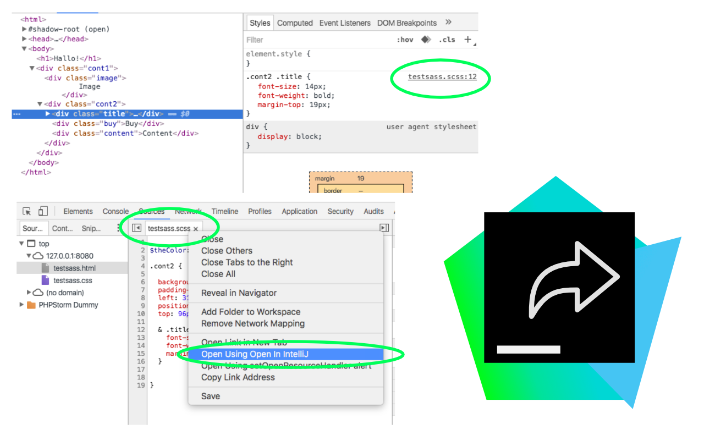
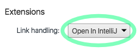

# Open in IntelliJ - Chrome DevTools Extension
This is an extension for Google Chrome to open resources from the Dev Tools (like CSS, SCSS, JS files) directly inside your IntelliJ IDE (WebStorm, PHPStorm etc.)
 
 

 
 
## Installation

1. Install the extension from the Chrome Web Store: 
https://chrome.google.com/webstore/detail/open-in-intellij/gpmmlokoechmmeboecialijibkjajlaj

2. Open Chrome DevTools, go to Settings. Under *Extensions* -> *Link Handling* select *Open In IntelliJ*.
 

3. Open one of your projects in your IntelliJ IDE (WebStorm, PHPStorm etc.). 
  Open the corresponding website in Chrome, inspect it, right-click on any resource and select *Open in IntelliJ*. 
Now the resource will be opened in your IDE.

4. If the web root of your IntelliJ project different from your project root, you have to do one the following methods in order for this extension to work:
	- Method 1: In IntelliJ right-click on the the directory that is the web root of the project and select *Mark directory as* -> *Sources Root*
	- Method 2: In Chrome go to chrome://extensions/ -> Open In Intellij -> Options. Under *Root Paths* set up the path mappings for your project. For example, if your site is www.yoursite.com (live) and yoursite.priv (local)) and within your IntelliJ project the web root for this site is under dist/web/, enter those site names under *Site* and the path under *Root Path*.

 

## Troubleshooting
If the links don't open in your IDE, try one or more of the following steps:
 

- Go into your WebStorm/PHPStorm Settings -> Build,Execution,Deployment -> Debugger -> Built-In Server and check  *Allow unsigned requests*.

- With your IntelliJ IDE open, open the following URL in Chrome: http://localhost:63342/ - if you get a 404 Not Found page that means the IntelliJ API is working.  
	Otherwise check the Port in IntelliJ Settings -> Build,Execution,Deployment -> Debugger -> Port. If the port is not 63342 go to your Chrome preferences -> Extensions -> Open In IntelliJ -> Options and adjust the URL under *Built-in Webserver URL*.

- Check if the IntelliJ REST API is working: Open a project in IntelliJ, choose any file and copy the relative path. Now in Chrome try to open *http://localhost:63342/api/file?file=path/to/file.js*, where you replace the file parameter with the path you just copied. If that doesn't open the file in IntelliJ there is a problem with the IntelliJ API on your machine.

- Make sure to check if you need to set up any path mappings (See instructions step 4)

